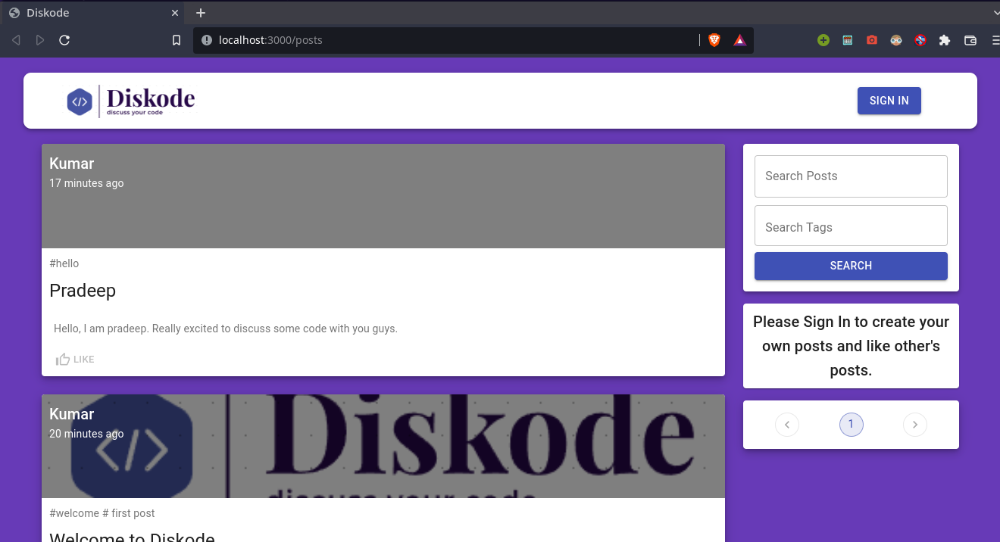
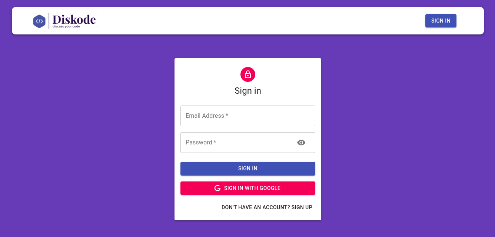
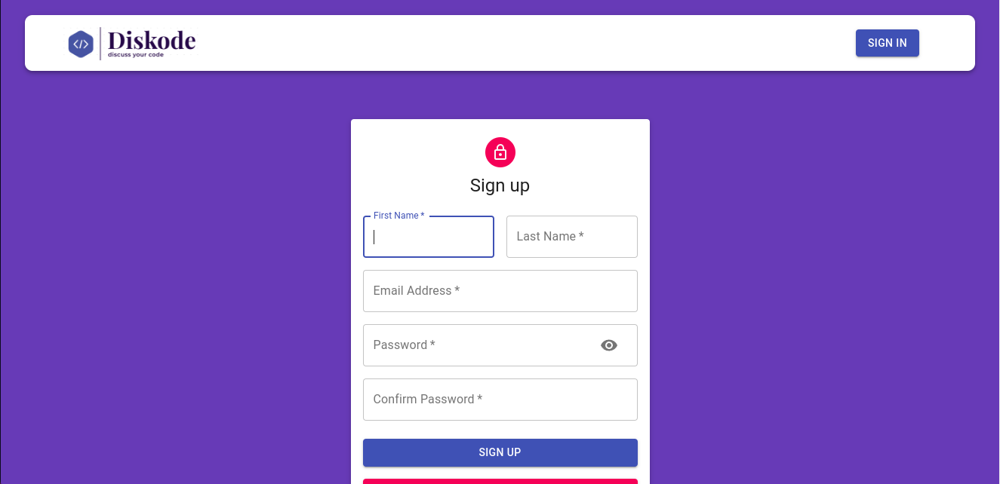
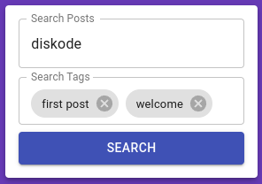
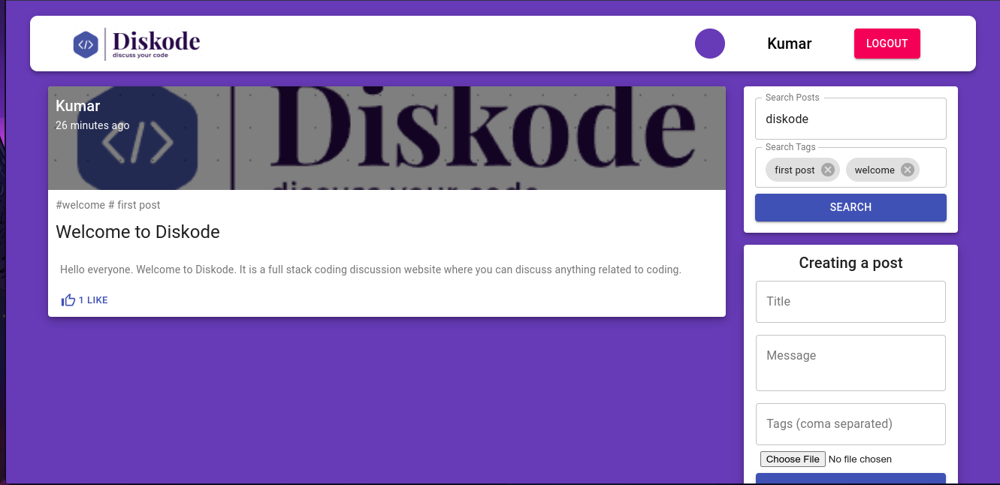
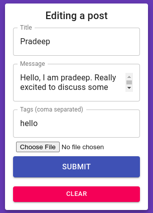

# DISKODE


## DESCRIPTION

A Full-stack MERN application with basic CRUD operations. A simple coding discussion web app to share anything related to coding in the form of posts.
- Authentication
  - Login with Google (Google OAuth)
  - Login with Email (JWT, bcrypt)
  - Token expiry
- User Roles
  - Login to create posts.
  - Like other's posts.
  - Delete your posts.
  - Edit your posts.
- Feature like search posts based on title and tags.
- Pagination:- Limited number of posts per page.

## SCREENSHOTS
- Homepage



- Sign In Page



- Sign Up Page



- Search Posts by Title and Tags



- Search Results



- Edit your posts




## CLIENT-SIDE DEPENDENCIES

```js
    "@material-ui/core": "^4.12.3",
    "@material-ui/icons": "^4.11.2",
    "@material-ui/lab": "^4.0.0-alpha.60",
    "@testing-library/jest-dom": "^5.11.4",
    "@testing-library/react": "^11.1.0",
    "@testing-library/user-event": "^12.1.10",
    "axios": "^0.24.0",
    "jwt-decode": "^3.1.2",
    "material-ui-chip-input": "^2.0.0-beta.2",
    "moment": "^2.29.1",
    "react": "^17.0.2",
    "react-dom": "^17.0.2",
    "react-file-base64": "^1.0.3",
    "react-google-login": "^5.2.2",
    "react-redux": "^7.2.6",
    "react-router-dom": "^6.2.1",
    "react-scripts": "4.0.3",
    "redux": "^4.1.2",
    "redux-thunk": "^2.4.1",
```

## SERVER-SIDE DEPENDENCIES

```js
    "bcryptjs": "^2.4.3",
    "body-parser": "^1.19.1",
    "cors": "^2.8.5",
    "dotenv": "^10.0.0",
    "express": "^4.17.1",
    "jsonwebtoken": "^8.5.1",
    "mongoose": "^6.1.1"
```

## LOCAL ENVIRONMENT SETUP 
- Clone repository 
```git
git clone https://github.com/saloni-15/Stalgia.git
```
- cd `Stalgia`

- Go to server, `cd server`.

- Install the dependencies
```npm
npm install
```

```

- Testing : Run `mongod` command on your terminal/ bash to start the Mongo server on port 27017(default)

- Start server by running `npm start` inside `server`.

- In another terminal, move to client, `cd client`.
 
- Install the dependencies
```npm
npm install
```
- Update the API in index.js inside `api` folder, `client\src\api\index.js`
  ```jsx
  const API = axios.create({ baseURL: "http://localhost:5000" });
  ```
  
```
REACT_APP_CLIENT_ID=YOUR_CLIENT_ID
```
- Start client by running `npm start` inside `client`.


